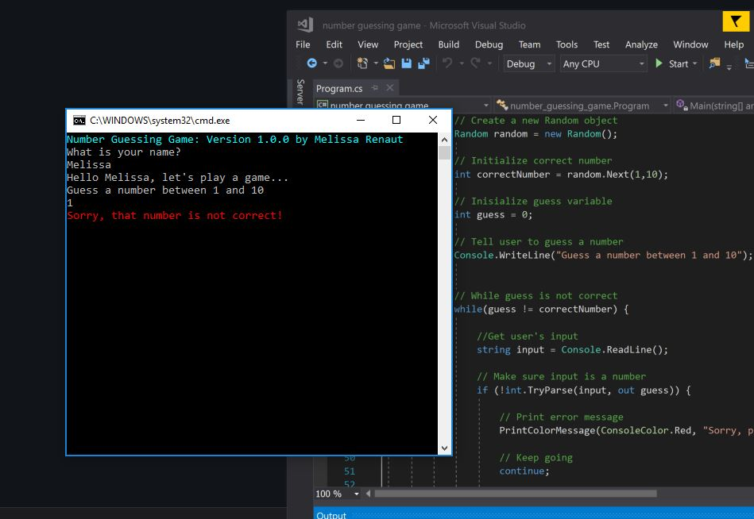

# Basic C# and .NET Application

## Console application number guessing game written in Visual Studio, with C# and a .NET framework.

Progam uses random number generation and validation.  User interacts using the Command Line Interface.

### Walkthrough Video

